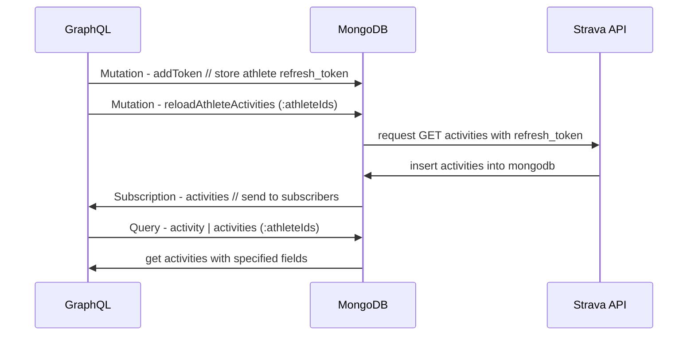

# sealway-strava

Caching request service to strava.
Entities cached/stored in mongodb and you can get them with graphQL


[](https://hub.docker.com/r/sealway/strava/)
[](https://hub.docker.com/r/sealway/strava/)



## Environments

- `STRAVA_CLIENT` - strava client id
- `STRAVA_SECRET` - strava secret id
- `MONGO_CONNECTION` (localhost) - mongo connection string
- `ACTIVITY_BATCH_SIZE` (50) - max batch size, after which data is sent to subscribers
- `ACTIVITY_BATCH_TIME` (45s) - time after which data is sent to subscribers
- `SLUG` (integration-strava) - prefix for url path
- `PORT` (8080) - server port

## API Endpoints

- GET `{SLUG}/healthz` - health check
- GET `{SLUG}/api/quota` - actual strava's request quota
- GET `{SLUG}/api/subscription` - used for registration strava [webhook](https://developers.strava.com/docs/webhooks/)
- POST `{SLUG}/api/subscription` - strava sends changes here
- GET `{SLUG}/graphql/` - graphQL playgroud
- [More](./interfaces/graph/schema.graphqls) about graphQL queries / mutations / subscriptions

## Debug

- set environments
  - `STRAVA_CLIENT`, `STRAVA_SECRET`, `MONGO_CONNECTION`
- localhost mongo `docker run -d --restart=always --name mongodb -p 27017:27017 mongo`
- local service `docker run -d --restart=always --name strava-graphql --network host -e STRAVA_CLIENT=<client_id> -e STRAVA_SECRET=<secret_id> sealway/strava`
  - strava api credentials [here](https://www.strava.com/settings/api)
- [graphql queries docs](https://graphql.org/learn/queries/)
- [timestamp converter](https://www.epochconverter.com/)

## Generate something

- Generate strava client
  - ```git clone https://github.com/swagger-api/swagger-codegen.git```
  - ```cd ./swagger-codegen```
    - for Windows in `./run-in-docker.sh` add `MSYS_NO_PATHCONV=1` before `docker run ...`
  - ```./run-in-docker.sh generate --input-spec https://developers.strava.com/swagger/swagger.json --lang go --output /gen/go/```
  - ```./run-in-docker.sh generate --input-spec https://developers.strava.com/swagger/swagger.json --lang openapi --output /gen/openapi/```
  - Replace
    - ```package swagger``` to ```package strava```
    - ```(json:"([^,]+),)``` to ```bson:"$2" $1```
- Generate grahpql with strava models
  - `cd ./graph`
  - `go run github.com/99designs/gqlgen generate`
  - Replace `model.` to `strava.` without mutations in `graph/generated/generated.go` and rollback `schema.resolvers.go`
    - `strava.NewAthleteToken` => `model.NewAthleteToken`
    - `strava.AthleteToken` => `model.AthleteToken`

## Upgrade

- change go version in `go.mod`
- `go get -u all`

## Problems

- graphql generate `[Type!]!` or `[Type!]` [here](https://github.com/graph-gophers/graphql-go/issues/78#issue-220709670)
